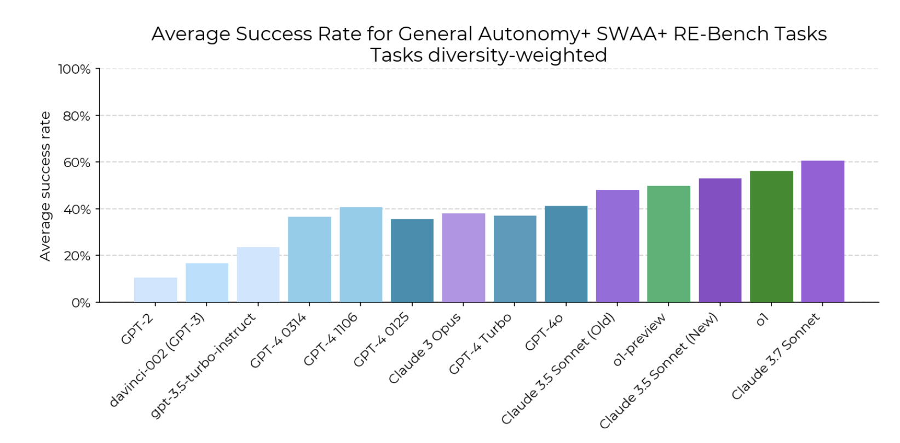
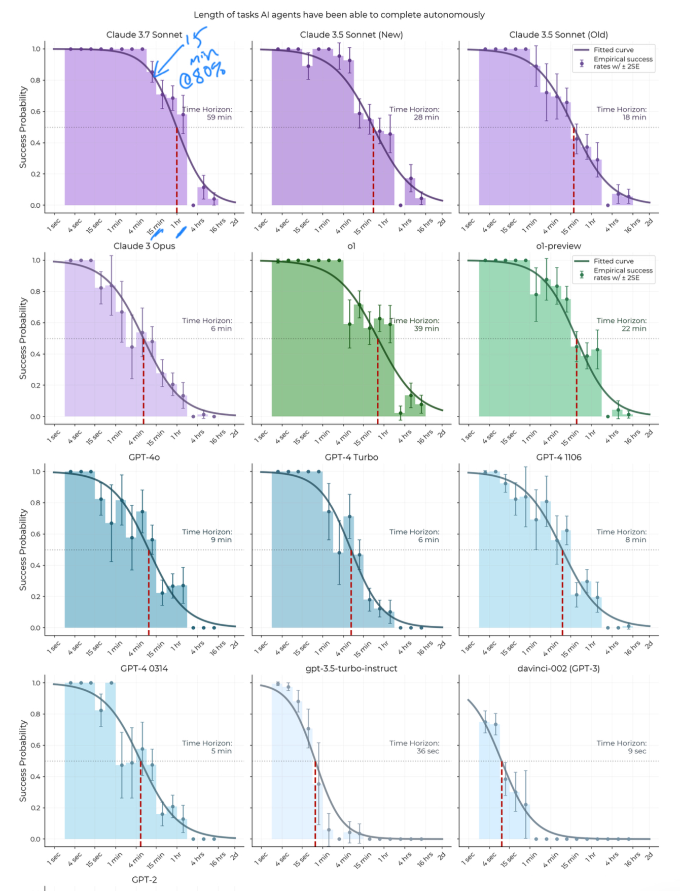
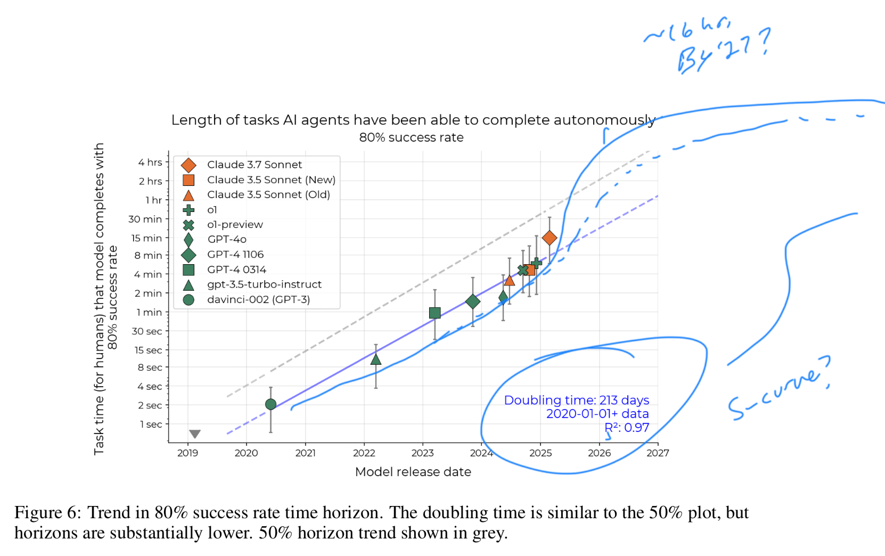
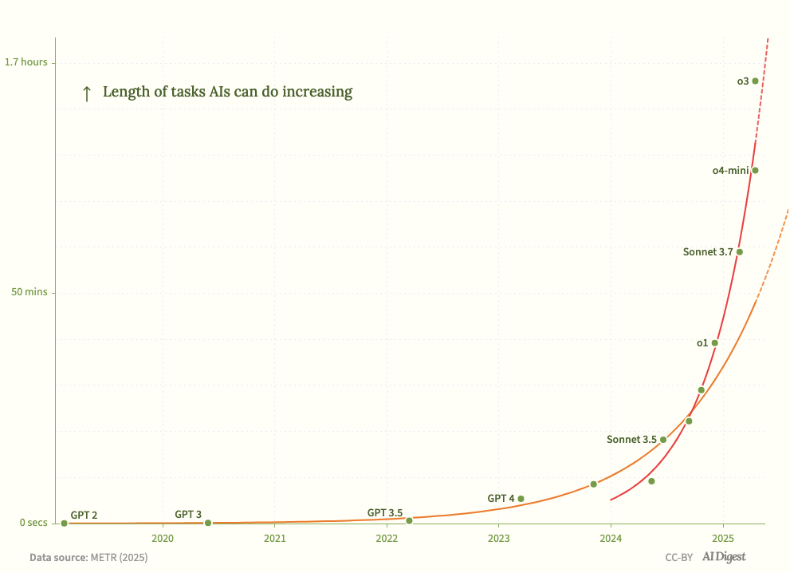
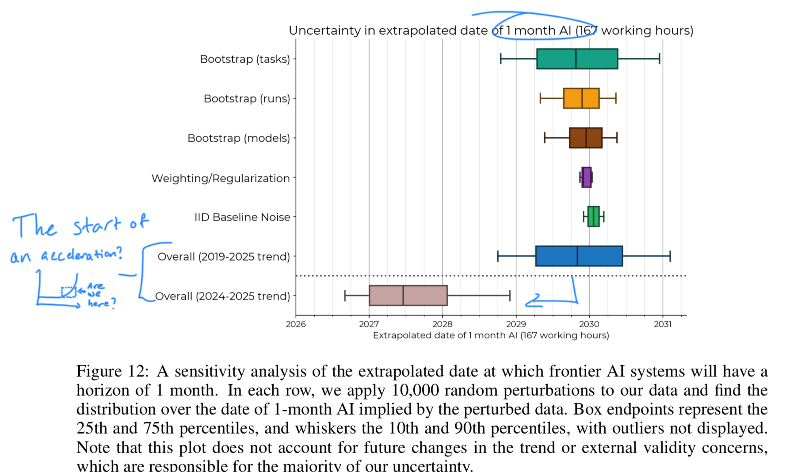

[Link to Paper](https://arxiv.org/abs/2503.14499)

A paper released in March 2025 by researchers at Model Evaluation & Threat Research [(METR)](https://metr.org/) evaluated the ability of AI models to complete long-horizon tasks. In my opinion this is a key measurement in tracking a.) the ability of AI models to produce economically valuable work and b.) the speed at which we are accelerating towards AGI (or not).

#### Takeaways
- AI models are getting better at completing long tasks
- *The pace at which models are improving* is accelerating
- The paper is limited to software engineering tasks, but in my opinion is a reasonable proxy for other domains, considering software can be used to automate tasks in other domains.
- From the abstract:
  - **Frontier AI time horizon has been doubling approximately every seven months since 2019, though the trend may have accelerated in 2024**
  - **If these results generalize to real-world software tasks, extrapolation of this trend predicts that within 5 years, AI systems will be capable of automating many software tasks that currently take humans a month.**
- "AI training compute usage has been increasing exponentially, doubling approximately every 2.3 months between 2012 and 2018"

I found this paper to be a rough proxy for measurements we can use to determine the timeline within which AI models can take over large swaths of human knowledge work. While limited to software engineering tasks, my view is that key parts of knowledge work can be automated with the right software, and that the reasoning & logic required for software can be applied to corporate work as well.

The first thing that jumps out is the pace: since the release of GPT-2 in 2019, "the length of tasks ... that generalist autonomous frontier model agents can complete with 50% reliability has been doubling approximately every 7 months." More importantly, in evaluating the 2023-2025 time period they also "measure the 80% time horizon of models and find a similar trend, though **horizons are roughly 5x shorter**." 

The tasks chosen for this evaluation were "designed to be realistic" and "economically useful" 6. In developing the test suite they "observed that real-world intellectual labor consists in part of measurable, single-step actions shorter than 1-minute" 6. Generally I agree with that view, depending on your responsibilities. For engineers, this could be finding certain files, pulling down documentation, or checking a wikipedia page.

The baseline used was individuals who have attended top-100 universities and have an average of 5 years of relevant experience.

You can see the steady increase in capability - and this doesn't include the latest o3/o4 and Gemini releases!

To get to the aforementioned projections, they find that when plotting the time horizons of each model against their release date, the actual horizon of useful work "doubled every 212 days" 10. While results vary due to diversity of human time spent on certain tasks, they find they are "confident in the slope of the time horizon trend than in the time horizon of any particular model" 10. This is consistent with industry views of a continued (and rapid) increase in AI capabilities - with model providers continuously leap-frogging each other.

This chart shows it well - showing sustained success probability (y-axis) across longer and longer time horizons (x-axis). Model releases go from top left to bottom right.

The next view is interesting - the authors specifically call out the "trend in 2024 and early 2025 may be faster, with o1 and Claude 3.7 Sonnet lying above the long-run trend ... [while being] robust to methodological ablations like using continuous scoring" 12.

Could this be the start of an s-curve - an acceleration of the trend?

This paper was originally published March 18, 2025. What is astounding is that, with the release of OpenAI's o3 in April, this acceleration seems to be validated. 

o3 and o4-mini are well above the trend line - *of a doubling time of 7 months* - which bring it down to time horizons **doubling every four months**. [AI Digest](https://theaidigest.org/time-horizons) overlays the latest results over the chart from METR:

Of note in the latest models is "their improved tool use capabilities" and a "markedly greater ability to adapt to mistakes" - but still "seem to struggle in intuitively 'messier' environments," 13 which is consistent with my experience. These "messy" environments - i.e., the real world - are the last mile before we see some material economic impact (imho).

They bucket failure modes into four categories:
- Poor planning and tool choice
- Incorrect mental math or reasoning
- Premature task abandonment
- Repeating failed actions

The "messy" environments can be better measured by these failure modes. Interestingly, they find that "trends in AI agent performance over time are similar for lower and higher messiness subsets" implying a general improvement with newer models (a rising tide lifting all boats, if you will). A nice statistic they include: "on sub hour tasks, success rates increased by 40 percentage points between January 2023 and May 2025 in both high and low messiness splits" - finding "no evidence of either much slower performance trends, or a plateau, specific to our higher messiness subset."

Will this hold with newer models, like Gemini 2.5 Pro, o3 and o4?

It seems likely to me. The authors find that "model time horizon computed from SWE-bench Verified tasks *seem to follow an exponential trend* from late 2023 through 2024. But they also find that the doubling time predicted by their 'messy' knowledge work tasks (HCAST + SWAA + RE-bench) is 104 days, "the doubling time predicted by the SWE-bench Verified results is slower - **around 70 days**."

They also find that15 "time horizons may have better correspondence to the labor of a low-context human, rather than a high-context human." This makes sense. The researchers brought on a bunch of contractors to benchmark the models against; they found that the more you need to explain to a contractor, the closer the performance was to the AI model - roughly similar to the context they had to provide the model. Compared to maintainers of certain code repositories - those who live it every day - contractor performance was "5x - 18x" worse. 

I found this parallel fascinating and instructive. **When filtering for use cases, or work to hand off to a model, consider how much context that job/workflow/task requires.** The less 'tribal knowledge,' the more likely it is the AI can replace the human.

As seen above, the release of o3 confirmed the trends identified this paper, at minimum continuing at pace (if not accelerating further). The last section of the paper is exactly that: Extrapolation.

They find 18 that the trend from 2019 - 2025 puts us between 2029 and 2031 (within error bars) for AI being able to "reach a 50% time-horizon of 1-month". Not quite "AGI by 2029" but I agree with the authors here: even an AI that can work for a month-equivalent with 50% reliability would have dramatic impacts for how we think about work.

The 2024-2025 trend pulls that extrapolation forward, to between the end of 2026 and 2029.

One thing worth noting is that this study is largely limited to software engineering tasks - so it's not guaranteed that these timelines extend to all knowledge work, [as some have argued](https://ai-2027.com/). Even though, any way you slice it, things are going to change *fast*.

Even with these impressive results, the authors note an important limitation and opportunity for improvement. They frame their work as a lower bound for model capabilities today. Specifically, they find that21 "properly eliciting models can make a very large difference in their performance", which is relatively obvious, but that they "put a limited amount of effort into eliciting models."

In all I find it incredibly exciting, if not somewhat disorienting, to see model capabilities developing this quickly. We'll be sure to check in when METR releases their next report.