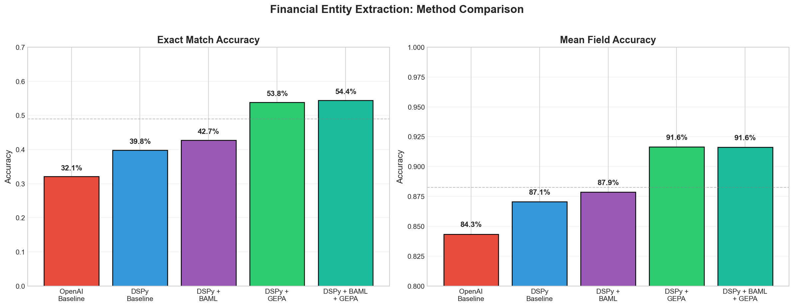
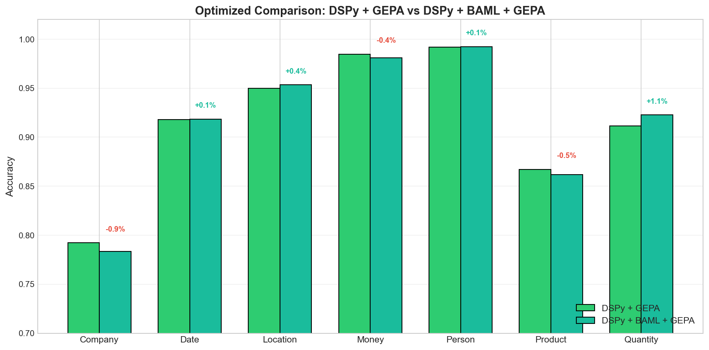
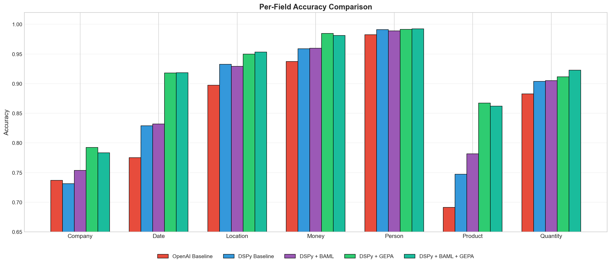
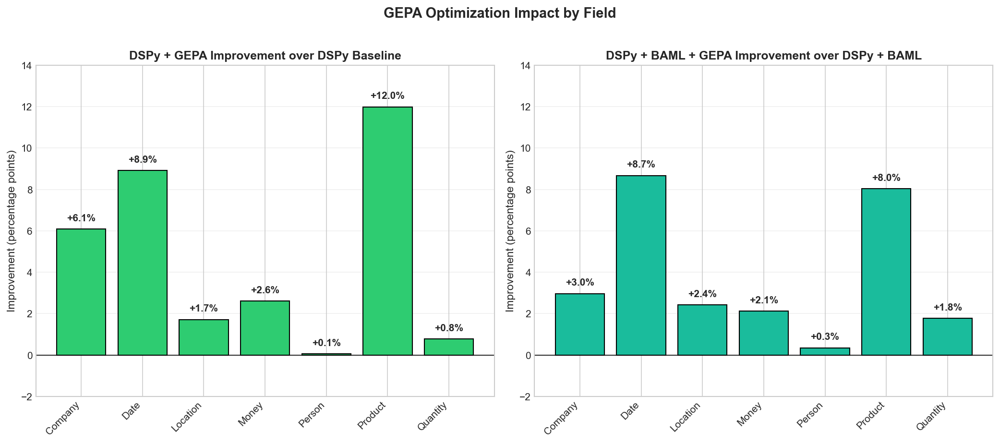

There's been lots of discussion recently on [DSPy](https://dspy.ai/) and the [GEPA optimizer](https://github.com/gepa-ai/gepa). And for good reason: the results are compelling. As evidenced by the below experiment using automatic prompt optimization, we're seeing 20+ percentage point improvements in exact match accuracy over vanilla LLM structured output calls with little engineering effort required. This simple example demonstrates how much low-hanging fruit there is in prompt optimization and AI engineering in general.

TLDR; Using DSPy + the GEPA optimizer + the BAML Adapter, one can achieve material improvement (20+ percentage points) on a data extraction task. To me, the benefit of this approach is not only improved performance, but that *optimization allows us to transfer a capability to cheaper models while retaining an acceptable accuracy, improving the cost profile of the application.*

> As a side note, while DSPy incorporates GEPA natively as an optimizer, GEPA stands alone in the sense that it is designed to be able to optimize "arbitrary systems composed of text components" - including, but not limited to, DSPy-like programs. [@LakshyAAAgrawal](https://x.com/LakshyAAAgrawal) & his team have done some interesting work here, and the [paper](https://arxiv.org/abs/2507.19457) is actually very approachable. 

> Separately, [BAML](https://github.com/BoundaryML/baml) is an alternative format for specifying schema information in your prompt. It's a great example of the flexibility of DSPy's Adapter paradigm.


## The Task

I recently ran across a [blog post by Cleanlab.ai](https://cleanlab.ai/blog/structured-output-benchmark/) which measures performance on structured information extraction using 'vanilla' structured outputs. This is a perfect setup that includes a few datasets, allowing us to put DSPy and GEPA to the test in a way that is measurable.


One of the datasets from the blog post evaluates financial entity extraction from news text, e.g., pulling out Companies, Dates, Locations, Money, People, Products, and Quantities from financial news articles. It's a solid test case for experimenting with GEPA because it has a.) clear ground truth b.) multiple entity types and c.) is mildly diverse in its inputs. There's also variability and 'real-world messiness' that may translate well to other use cases. For example, there are elements that the models may confuse (e.g., gpt-4.1 often confused "Apache Spark" between Company and a Product) that we can optimize out.

For this quick experiment I used the [financial dataset](https://huggingface.co/datasets/Cleanlab/fire-financial-ner-extraction), though their [repo](https://github.com/cleanlab/structured-output-benchmark) has other example datasets across data tables, insurance claims, and PII extraction.


## The Approach

Using Claude Code with Opus 4.5, I measured OpenAI GPT 4.1-mini's performance across a series of standard tasks from Cleanlab's dataset. Claude Code was a *significant* accelerant in this process; from idea to blog post this took about ~3 hours including a bunch of my fumbling around.

I incrementally added elements that I thought should lead to improved performance:

1. **OpenAI Baseline** - Direct API calls with a hand-crafted system prompt
2. **DSPy Baseline** - Same task using DSPy's declarative signatures
3. **DSPy + BAML** - DSPy with BAML as the structured output adapter
4. **DSPy + GEPA** - DSPy baseline optimized with GEPA
5. **DSPy + BAML + GEPA** - The full stack, optimized

All experiments used `gpt-4.1-mini` for extraction and `gpt-4.1` for GEPA's reflection. GEPA was run using the `medium` budget preset. There's a lot of low hanging fruit here to explore: experimenting with the reflection LM's `temperature`, using `gpt-5.2`, and/or `high` for the budget, etc.


### OpenAI Baseline
The baseline prompt (from Cleanlab) is straightforward:
```python
import openai

ORIGINAL_SYSTEM_PROMPT = """Identify and extract entities from the following financial news text into the following categories:

Entity 1: Company 
⋆ Definition: Denotes the official or unofficial name of a registered company or a brand.
⋆ Example entities: {Apple Inc.; Uber; Bank of America}

Entity 2: Date 
⋆ Definition: Represents a specific time period, whether explicitly mentioned (e.g., "year ended March 2020") or implicitly referred to (e.g., "last month"), in the past, present, or future.
⋆ Example entities: {June 2nd, 2010; quarter ended 2021; last week; prior year; Wednesday}

Entity 3: Location 
⋆ Definition: Represents geographical locations, such as political regions, countries, states, cities, roads, or any other location, even when used as adjectives.
⋆ Example entities: {California; Paris; 1280 W 12th Blvd; Americas; Europe}

Entity 4: Money 
⋆ Definition: Denotes a monetary value expressed in any world currency, including digital currencies.
⋆ Example entities: {$76.3 million; $4 Bn; Rs 33.80 crore; 1.2 BTC}

Entity 5: Person 
⋆ Definition: Represents the name of an individual.
⋆ Example entities: {Meg Whitman; Mr. Baker; Warren Buffet}

Entity 6: Product 
⋆ Definition: Refers to any physical object or service manufactured or provided by a company to consumers, excluding references to businesses or sectors within the financial context.
⋆ Example entities: {iPhone; Tesla model X; cloud services; Microsoft Windows 10; laptops; medical equipment; computer software; online classes; eye surgery}

Entity 7: Quantity 
⋆ Definition: Represents any numeric value that is not categorized as Money, such as percentages, numbers, measurements (e.g., weight, length), or other similar quantities. Note that unit of measurements are also part of the entity.
⋆ Example entities: {15%; 25,000 units; 2.75in; 100 tons}

For each category:
- Extract all relevant entities as a list of strings, preserving the wording from the text
- Use None if no entities are found in that category
- Only extract entities that are explicitly mentioned in the text itself, do not make inferences or reason about what entities might be implied based on URLs, domain names, or other indirect references
- Extract individual items rather than compound or ranged entities (e.g., if a range or compound entity is mentioned, extract each individual item separately)

Return the extracted information as a JSON object with all categories included, using None for cases where no entities are found.
"""

def get_openai_response(text: str, model: str = "gpt-4.1-mini") -> dict:
    """Get structured output from OpenAI API directly."""
    response = openai.chat.completions.parse(
        messages=[
            {"role": "system", "content": ORIGINAL_SYSTEM_PROMPT},
            {"role": "user", "content": text}
        ],
        model=model,
        response_format=ExtractedEntities,
    )
    return json.loads(response.choices[0].message.content)
```

### DSPy Baseline

In keeping with the original blog post I kept the Pydantic model for `ExtractedEntities` very simple; this almost certainly should be improved for production use cases. I basically took the Baseline prompt above and fed that to Opus 4.5 to create the below Pydantic model. 

```python
class ExtractedEntities(BaseModel):
    """Extracted entities from financial news text."""
    Company: Optional[List[str]] = Field(default=None, description="Official or unofficial names of registered companies or brands")
    Date: Optional[List[str]] = Field(default=None, description="Specific time periods, explicit or implicit")
    Location: Optional[List[str]] = Field(default=None, description="Geographical locations including regions, countries, cities, roads")
    Money: Optional[List[str]] = Field(default=None, description="Monetary values in any currency including digital currencies")
    Person: Optional[List[str]] = Field(default=None, description="Names of individuals")
    Product: Optional[List[str]] = Field(default=None, description="Physical objects or services provided by companies")
    Quantity: Optional[List[str]] = Field(default=None, description="Numeric values not categorized as Money (percentages, measurements, etc.)")
```

Then I wrapped the instructions in a `Signature` to match the "naive" approach.

```python
# Define DSPy Signature for entity extraction
class FinancialEntityExtraction(dspy.Signature):
    """Extract named entities from financial news text.
    
    Entity definitions:
    - Company: Official or unofficial names of registered companies or brands (e.g., Apple Inc., Uber, Bank of America)
    - Date: Time periods, explicit or implicit (e.g., June 2nd 2010, last week, prior year)
    - Location: Geographical locations including regions, countries, cities (e.g., California, Paris, Europe)
    - Money: Monetary values in any currency including digital (e.g., $76.3 million, Rs 33.80 crore, 1.2 BTC)
    - Person: Names of individuals (e.g., Meg Whitman, Mr. Baker, Warren Buffet)
    - Product: Physical objects or services provided by companies (e.g., iPhone, cloud services, medical equipment)
    - Quantity: Numeric values not Money - percentages, measurements (e.g., 15%, 25,000 units, 2.75in)
    
    Guidelines:
    - Extract entities exactly as they appear in the text
    - Use null/None if no entities found for a category
    - Only extract explicitly mentioned entities, do not infer from URLs or context
    - Extract individual items, not compound or ranged entities
    """
    
    text: str = dspy.InputField(desc="Financial news text to extract entities from")
    entities: ExtractedEntities = dspy.OutputField(desc="Extracted entities organized by category")
```


### DSPy + BAML
Enabling BAML is incredibly easy thanks to [@tech_optimist](https://x.com/tech_optimist) who added the PR for it.

Keeping all else equal, you simply import BAML and set it as the default global DSPy adapter.
```python
# Import the BAML Adapter
from dspy.adapters.baml_adapter import BAMLAdapter

# Configure DSPy with the same model
lm = dspy.LM(model="openai/gpt-4.1-mini", temperature=0.0)
dspy.configure(lm=lm, adapter=BAMLAdapter())
```

From there the rest of the code remains basically the same.

### DSPy + GEPA

Using GEPA involves setting up your Examples, Metrics, and finally specifying the parameters for the optimizer. See the [repository](https://github.com/kmad/dspy-optimizer-experiment) for the full implementation.

Here we specify the reflection LM as gpt-4.1, but could use anything else (e.g. gpt-5.2, Opus 4.5, etc.)

```python
# Initialize GEPA optimizer
reflection_lm = dspy.LM(
    model="openai/gpt-4.1",  # Stronger model for reflection
    temperature=1.0, #
    max_tokens=16000,
)
gepa_optimizer = dspy.GEPA(
    metric=extraction_metric_with_feedback,
    reflection_lm=reflection_lm,
    auto="medium",  # can use 'light', 'medium', or 'heavy'
    track_stats=True
)
```

### DSPy + BAML + GEPA
DSPy + BAML + GEPA is essentially all of the above wrapped into one. Nothing else changes other than enabling BAML as the global DSPy adapter and running GEPA as normal.

## Results

The results are compelling. As has been explored ad infinitum on DSPy-twitter, optimization can have a real, measurable improvement on a given task provided you have data to compare against (and arguably, even when you don't - more to come here). [Omar Khatteb](https://x.com/lateinteraction) and [Chris Potts](https://x.com/@ChrisGPotts) [put it elegantly](https://x.com/lateinteraction/status/1999601579100422175): the optimization process "discovers latent requirements".




| Method | Exact Match | Mean Field |
|--------|-------------|------------|
| OpenAI Baseline | 32.07% | 84.34% |
| DSPy Baseline | 39.79% | 87.06% |
| DSPy + BAML | 42.74% | 87.86% |
| DSPy + GEPA | 53.84% | 91.64% |
| DSPy + BAML + GEPA | 54.43% | 91.62% |

GEPA optimization delivers a ~14 percentage point improvement over the DSPy baseline, and ~22 percentage points over the raw OpenAI baseline. Each optimization run took approximately 5-10 minutes.

## BAML
BAML only provided marginal improvement here, as seen below. My sense is this is because the JSON schema is simple enough that we don't benefit from the simplified structure of BAML. In this experiment we're just looking for the list of elements to be extracted properly. BAML shines when the schema is very complex with nested fields or more complicated structure. 


## Per-Field Breakdown

On a per-field basis we see where GEPA really made gains: Company, Date, and Product fields:




<br><br>

Looking at individual entity types reveals where the gains come from:



The biggest wins are in **Product** (+12pp) and **Date** (+9pp) extraction. These are exactly the categories where prompt wording matters most - the difference between "extract products" and more specific guidance about what constitutes a product vs. a company name.

## What's Happening Here

GEPA (Genetic-Pareto optimization) works by:

1. Running your program on training examples
2. Analyzing failures and generating targeted feedback
3. Using an LLM to propose improved instructions based on that feedback
4. Maintaining a Pareto frontier of candidates that excel on different subsets

It's not just hill-climbing on a single metric; it keeps diverse candidates around that handle different edge cases well. I haven't tested this rigorously but my sense is these characteristics are a perfect fit for DSPy's Module structure. You not only get the benefit of reasoning about your program in modular components, but you can optimize them, too (separately or as a cohesive unit).

The optimized prompts GEPA discovers tend to be more specific about entity boundaries, better at disambiguating categories, and include implicit examples from the training failures.

## Observations

**DSPy alone doesn't always beat the baseline.** On some fields (Company, for instance), the DSPy baseline actually performs slightly worse than a well-crafted manual prompt. The value of DSPy is the modularity and the ability to optimize and not magic out of the box.

**BAML provides marginal gains with simple output schemas.** The structured output adapter helps with consistency but isn't a game-changer on its own. Where it shines (my intuition is, at least) is in combination with optimization and with more complicated schemas (nested objects, etc.).

**Optimization is where the real gains are.** Whether you're using vanilla DSPy or DSPy+BAML, adding GEPA optimization gets you to roughly the same place (~54% exact match, ~92% field accuracy). The optimizer finds its way to better prompts regardless of the starting point.

**The optimizer is (relatively) cost-effective.** GEPA used about 1,200 rollouts to find these improvements - that's roughly $2-3 in API costs for a 22-point accuracy boost that applies to every future inference vs. a human manually tweaking prompts & hoping for the best. *Importantly, optimization allows us to transfer the capability to cheaper models while retaining performance, improving the cost profile of the application.*

## Code

The full original experiment code is available in the [structured-output-benchmark repo](https://github.com/cleanlab/structured-output-benchmark). 

My modifications & code can be found at [https://github.com/kmad/dspy-optimizer-experiment](https://github.com/kmad/dspy-optimizer-experiment).


*All experiments run December 2025 using gpt-4.1(-mini). Your results may vary with different models or datasets.*

---
# Appendix

### Original prompt for OpenAI Baseline (from blog post):
```python
"""Identify and extract entities from the following financial news text into the following categories:

Entity 1: Company 
⋆ Definition: Denotes the official or unofficial name of a registered company or a brand.
⋆ Example entities: {Apple Inc.; Uber; Bank of America}

Entity 2: Date 
⋆ Definition: Represents a specific time period, whether explicitly mentioned (e.g., "year ended March 2020") or implicitly referred to (e.g., "last month"), in the past, present, or future.
⋆ Example entities: {June 2nd, 2010; quarter ended 2021; last week; prior year; Wednesday}

Entity 3: Location 
⋆ Definition: Represents geographical locations, such as political regions, countries, states, cities, roads, or any other location, even when used as adjectives.
⋆ Example entities: {California; Paris; 1280 W 12th Blvd; Americas; Europe}

Entity 4: Money 
⋆ Definition: Denotes a monetary value expressed in any world currency, including digital currencies.
⋆ Example entities: {$76.3 million; $4 Bn; Rs 33.80 crore; 1.2 BTC}

Entity 5: Person 
⋆ Definition: Represents the name of an individual.
⋆ Example entities: {Meg Whitman; Mr. Baker; Warren Buffet}

Entity 6: Product 
⋆ Definition: Refers to any physical object or service manufactured or provided by a company to consumers, excluding references to businesses or sectors within the financial context.
⋆ Example entities: {iPhone; Tesla model X; cloud services; Microsoft Windows 10; laptops; medical equipment; computer software; online classes; eye surgery}

Entity 7: Quantity 
⋆ Definition: Represents any numeric value that is not categorized as Money, such as percentages, numbers, measurements (e.g., weight, length), or other similar quantities. Note that unit of measurements are also part of the entity.
⋆ Example entities: {15%; 25,000 units; 2.75in; 100 tons}

For each category:
- Extract all relevant entities as a list of strings, preserving the wording from the text
- Use None if no entities are found in that category
- Only extract entities that are explicitly mentioned in the text itself, do not make inferences or reason about what entities might be implied based on URLs, domain names, or other indirect references
- Extract individual items rather than compound or ranged entities (e.g., if a range or compound entity is mentioned, extract each individual item separately)

Return the extracted information as a JSON object with all categories included, using None for cases where no entities are found.
"""
```

### DSPy + GEPA Optimized Prompt (formatting & emphasis added by LLM for readability):


You are given a passage from a financial news article or company report. Your task is to carefully extract explicitly mentioned named entities according to the following categories and rules, returning them in a structured format.

#### Entity Categories and Definitions

**1. Company**
- Extract official or unofficial names of registered companies, corporate entities, or brands exactly as mentioned in the text.
- Include subsidiaries and affiliates if explicitly named.
- Do **not** extract government entities unless clearly referenced as shareholders or corporate-like entities within the financial context.
- For possessive references (e.g., “Nissan's”), include the possessive as part of the name.

**2. Date**
- Extract only explicit temporal references (e.g., specific dates, months, years, clearly defined periods).
- If the date is part of a longer phrase (e.g., “end of May 2019”), extract the full phrase for context.
- Avoid vague or inferred time periods not clearly stated.

**3. Location**
- Extract only explicitly named geographical places (countries, cities, regions).
- If a national adjective modifies a government or company (e.g., “French Government”), extract the adjective (e.g., “French”) as a Location.

**4. Money**
- Extract full monetary expressions, preserving any units, context, and descriptions (e.g., “$31.56 per ton produced”).
- Always include the complete phrase.

**5. Person**
- Extract the names of individuals as they appear, including titles or honorifics if explicitly stated (e.g., “Mr. Baker”).

**6. Product**
- Extract only when a physical product or service is unambiguously identified and directly tied to a company or business activity.
- Do **not** extract general business terms or categories unless a clear product/service name is explicitly mentioned.

**7. Quantity**
- Extract explicitly stated numeric values (percentages, units, quantities, discrete measures) that are **not** monetary.
- Do **not** extract vague quantifiers or text referring only to amounts without a clear unit.

---

#### Instructions for Extraction

- Return each named entity **exactly** as it appears in the text (including spelling, casing, punctuation, and phrasing).
- **Do NOT** infer, deduce, or hallucinate entities based on context or prior knowledge.
- For categories **not** present in the text, output `None` (or `null`) for that category.
- **Never** merge, split, or reformat entities; capture them as they are written, even if there is overlap (e.g., “Nissan's” and “Nissan” are distinct).
- For ranges or compounds (like “15-20%”), extract ONLY the individual components that are clearly mentioned (not the combined range).
- For parenthetical or descriptive context (like “in thousands, except per share data”), only extract as Quantity if it is a direct measurement or value in a financial sense.
- **Special Case:** If a national adjective appears in a company or government name (e.g., “French Government”), extract the adjective (e.g., “French”) as Location, and the full phrase as Company (if in the context of ownership/stake).

---

#### Output Formatting

Return your results strictly in this format:

```
entities
Company=[...] Date=[...] Location=[...] Money=[...] Person=[...] Product=[...] Quantity=[...]
```

Replace `[...]` with a **list** of exactly-quoted entities for each category (e.g., `['Apple Inc.', 'TappIn']`) or `None` if no entities for that category.

---

#### Examples

> **Input:**  
> Direct operating costs were \$31.56 per ton produced in the current year compared to \$29.86 per ton produced in the prior year.
>
> **Output:**  
> Company=None Date=['current year', 'prior year'] Location=None Money=['\$ 31.56 per ton produced', '\$ 29.86 per ton produced'] Person=None Product=None Quantity=None

---

> **Input:**  
> In 2011, we enhanced our product offerings through the acquisition of TappIn, a secure content mobility solution company.
>
> **Output:**  
> Company=['TappIn'] Date=['2011'] Location=None Money=None Person=None Product=None Quantity=None

---

> **Input:**  
> Our investment activities are managed by Ares Capital Management, which is wholly owned by Ares, and supervised by our board of directors, a majority of whom are independent of Ares and its affiliates.
>
> **Output:**  
> Company=['Ares Capital Management', 'Ares'] Date=None Location=None Money=None Person=None Product=None Quantity=None

---

> **Input:**  
> At the end of May 2019, news broke of a potential $35 billion merger-of-equals between Renault and Fiat Chrysler, aiming to create the third largest car manufacturer. The deal allegedly failed due to Nissan's abstaining from voting on the merger proposal and the French Government's stake in Renault.
>
> **Output:**  
> Company=['Renault', 'Fiat Chrysler', "Nissan's", 'French Government'] Date=['end of May 2019'] Location=['French'] Money=['$35 billion'] Person=None Product=None Quantity=None

---

**Strictness:**  
Be strict and literal in your extraction. Only output what is explicitly stated. Any deviation from these rules or the required output format will be considered incorrect.
"""
