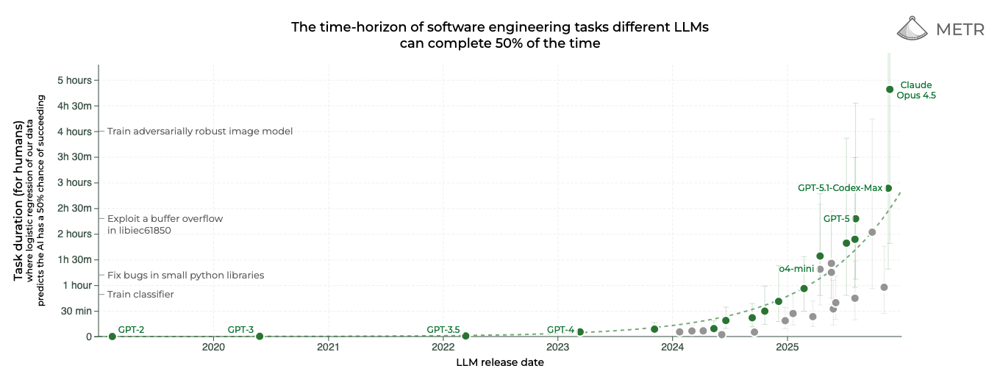
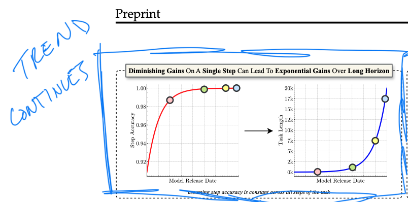
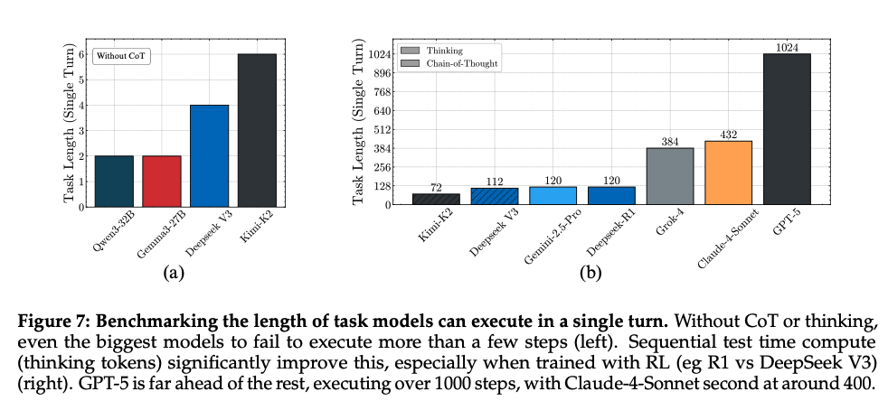
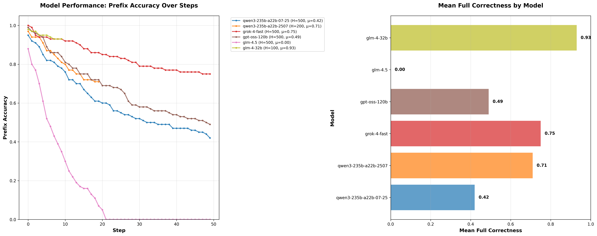
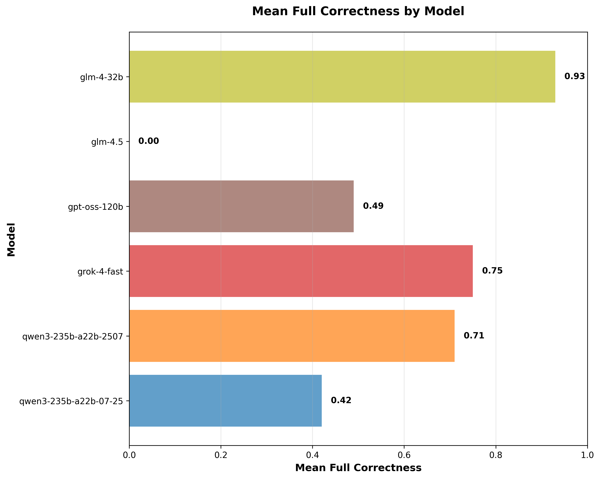
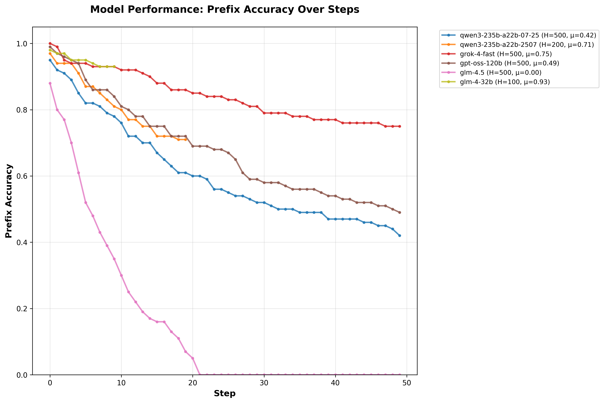

# AI's Hedonic Treadmill

> *Originally written September 2025 - a lot has changed between now and December when I'm posting this!*

The concept of the [hedonic treadmill](https://en.wikipedia.org/wiki/Hedonic_treadmill) is that people have a tendency to return to a baseline happiness level after major life changes or the "introduction of new stimuli". I get the sense that's what is happening to observers of new AI models who say we're hitting a wall. 

There's a narrative that we could be hitting a "data wall", which is the point where scraping more training data from the internet yields diminishing returns, forcing companies to rethink their strategies. Despite this skepticism, hyperscalers are doubling down, committing billions to massive capital expenditures (CAPEX) on AI infrastructure. To some it may seem reckless, but it's a calculated bet on the continued scaling of LLMs, predicated on the assumption that more compute will unlock not just incremental improvements, but transformative economic value. And the levels of CAPEX [have been significant](https://x.com/KobeissiLetter/status/1967969977702682930). The question for most is why pour resources into data centers and semis when benchmarks seem to be plateauing? 

To me it's because the benchmarks are largely saturated and are mostly one-dimensional in what they measure. The industry is still grappling with the best ways to measure long horizon economic value (something [METR](https://metr.org/) has been pioneering).

> *December update:* We now have [GDPVal](https://openai.com/index/gdpval/) from OpenAI and an [Economic Index Report](https://www.anthropic.com/research/anthropic-economic-index-september-2025-report) from Anthropic, among others.

Every model release is hyped to be the same 'step change' we witnessed from GPT-3 to GPT-4. Many in the industry are holding out for another leap like that—a dramatic surge in capabilities that redefines what's possible. With regular releases and impressive capabilities, we're on somewhat of a hedonic treadmill; we immediately update our expectations of what these models can do.

Some think we're hitting a ceiling: I'd submit we're just not measuring the right things. We haven't even scratched the surface of understanding what these models are capable of - [embodied beautifully](https://x.com/karpathy/status/1816531576228053133?lang=en) by Karpathy's "jagged intelligence".

> The excitement around Opus 4.5 is a good example of this; 

A recent pre-print paper, ["The Illusion of Diminishing Returns: Measuring Long Horizon Execution in LLMs"](https://arxiv.org/abs/2509.09677) is an attmpe to measure one dimension: long-horizon instruction following. The authors argue that while many benchmarks emphasize an LLM's ability to plan and reason, isolating execution is key to evaluating long-horizon capabilities.

This is the "holy grail" of AI: a long-running agent that can accomplish tasks with accuracy sufficient to delegate economically useful work. The authors drive this home: 
> *"If the length of tasks a model can complete indicates its economic value, continued investment in scaling compute might be worth the cost, even if short-task benchmarks give the illusion of slowing progress."* 

Experiments like these likely fuel the aggressive investment we're seeing today. In short, AI *works* and is *getting better*. The [Bitter Lesson](http://www.incompleteideas.net/IncIdeas/BitterLesson.html)—that scaling compute and data tends to outperform clever engineering—remains undefeated, for now.

The authors tackle this head-on, asserting that "single-turn or short-task benchmarks may be an illusory reference for evaluating benefits for further investment in LLM compute." They explain that while single-step benchmarks saturate and lose relevance as indicators of progress—"giving a mirage of slowing progress"—the length of tasks a model can complete, which "*is a better indicator of economic value*," **continues to grow fast**.

Translation: More money → more compute → longer tasks LLMs can complete → more economic value on autopilot. This is precisely why Zuck [said he'd rather misspend than lose the AI race](https://youtu.be/23FyskyFoP8?list=PLYBBGzU9Jm9kJX1OKqW3GdXA17KWCaqij&t=4149).

METR has done stellar work in this space, evaluating the length of tasks LLMs can reliably accomplish. The paper's authors draw on similar benchmarks, using a 50% task accuracy threshold to project potential gains.

> December update: One of my favorite METR graphs, shows the insanity of Opus 4.5


This matters on a theoretical level because once step accuracy exceeds 75% and nears 100%, the achievable horizon length *grows faster than exponentially* as a function of that step accuracy.

**This is what people are betting on.**


The paper highlights several intriguing contributions:

- LLMs "self-condition," meaning models "become more likely to make mistakes when the context contains their errors from prior turns." This aligns with what we know about in-context learning and underscores a critical challenge for working with LLMs. **Context management is important!** (and it's never a bad time to plug [DSPy](https://dspy.ai))

Notably, thinking models (those with chain-of-thought prompting or similar) didn't exhibit this flaw, likely due to their ability to "backtrack" and diagnose errors. This distinction is crucial when weighing cost and speed tradeoffs between model types.

The team observed stark differences in performance: DeepSeek V3 struggles with even 2 steps, while R1 can handle *200*. GPT-5 with thinking can execute over 1,000!

A core thesis of the paper is that "diminishing gains on a single step" (think: performance on a basic Q&A benchmark) "can lead to *exponential gains over a long horizon*" (i.e., economically useful capabilities). I liken this to compound interest: A few dollars saved per month might not dazzle in isolation, but over decades, your nest egg balloons. The same principle applies here. Chain together reliable simple tasks, and the zoomed-out impact becomes profound.



## The Experiment

The experiment was cleverly designed to isolate the LLM's long-horizon *execution* ability, stripping away elements of planning and knowledge recall. The core idea? Test how well a model handles a sequence of simple, repetitive tasks—a common failure point for even the largest models.

The setup is elegantly straightforward: It breaks down a long-horizon task into a basic, stateful operation—adding values from a provided dictionary.

This approach serves three key purposes:
- Isolate execution from other skills.
- Identify "self-conditioning" (what I call context poisoning or [context rot](https://x.com/simonw/status/1935478180443472340)).
- Measure scaling laws in action.

The model receives a fixed dictionary of common five-letter English words paired with integer values, plus an explicit plan (a sequence of keys) for each turn. This setup eliminates reliance on the model's internal knowledge or plan generation, zeroing in on pure execution.

Starting with a sum of zero, the model's job per turn is:
- Look up the integer value(s) for the key(s) in the current plan.
- Add them to the running sum from the previous turn.
- Output the updated total.

Task length is tuned via two variables: the number of turns and "turn complexity" (K), or how many keys to process per turn.

It's a deceptively simple test, but any "AGI-like" system should ace it—making failures all the more telling. As noted earlier, the gap between thinking and non-thinking models is eye-opening.



## Results

I ran the dict-sum experiment (500-step horizon, dict size 100, working capacity 10, 100 samples per model, multi-turn CoT thinking) on several models via OpenRouter - (these are a hodgepodge mostly because they were cheap and experiments take quite a bit of time):



**Key findings:**
- GLM-4 32B: 93% full correctness (surprisingly strong!)
- Grok-4-fast free: 75%
- Qwen3 235B variants: ~70-42%
- GPT-OSS 120B: 49%
- GLM-4.5/4.6: mid-range

Prefix accuracy holds >80% up to ~40-50 steps for top models, dropping gradually—showing reliable long-horizon execution.





These results align with the paper: thinking models sustain high performance over long horizons despite single-step benchmarks saturating.


## Key Takeaways and Why It Matters

The results from this benchmark paint a bullish picture for scaling enthusiasts. Non-thinking models taper off quickly, often crumbling under error accumulation in the context window. But "thinking" variants—leveraging step-by-step reasoning—extend horizons dramatically, sometimes by orders of magnitude. This isn't just academic; it's a signal that investments in compute could unlock agents capable of managing workflows like software debugging, data analysis, or even supply chain optimization without constant human oversight.

Zuck's billions make sense in this light. We're not plateauing; we're on the cusp of compounding gains that could redefine productivity. If long-horizon execution keeps scaling as the paper suggests, the economic payoff could justify every dollar. The AI race isn't about scraping more data—it's about building systems that *do* more, reliably, over time. Watch this space; the next jumps might not show up on MMLU scores, but they'll transform how we work.


# Appendix

The code provided by the authors is actually pretty approachable. Below is the command used to get the code running. Here I used the free deployment of the new Grok 4 Fast (specified by `--cfg.model_config.name "x-ai/grok-4-fast:free" \`). OpenRouter is a great way to test a bunch of models. I ran a bunch of different ones by changing the `model_config.name` value. 

```bash
 uv run main.py --cfg.exp dict_sum \
    --cfg.model_config.provider "openrouter" \
    --cfg.model_config.name "x-ai/grok-4-fast:free" \
    --cfg.model_config.thinking_mode true \
    --cfg.model_config.cot true \
    --cfg.model_config.max_model_len 40960 \
    --cfg.experiments.dict_sum.num_samples 100 \
    --cfg.experiments.dict_sum.dict_size 100 \
    --cfg.experiments.dict_sum.working_capacity 10 \
    --cfg.experiments.dict_sum.horizon_length 500 \
    --cfg.experiments.dict_sum.llm_temperature 0.6 \
    --cfg.experiments.dict_sum.llm_top_p 0.95 \
    --cfg.experiments.dict_sum.llm_max_tokens 100000 \
    --cfg.experiments.dict_sum.max_input_value 99 \
    --cfg.experiments.dict_sum.min_input_value -99 \
    --cfg.wandb_settings.mode "disabled" \
    --cfg.wandb_settings.project "frontier-final" \
    --cfg.experiments.dict_sum.local_dataset_path "dict_sum_100.json"
```