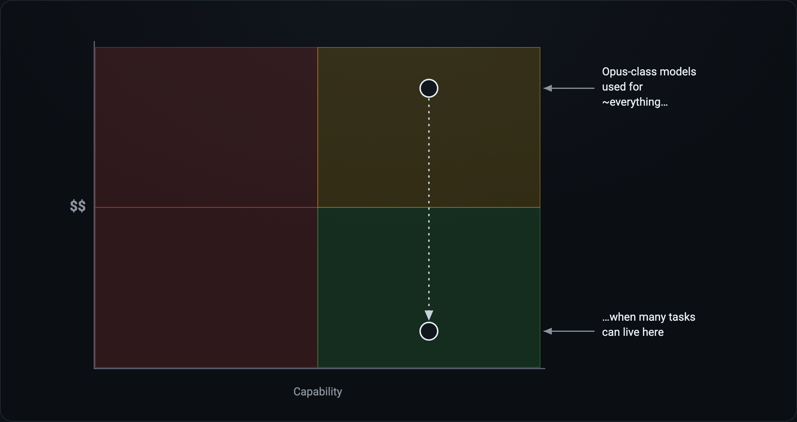
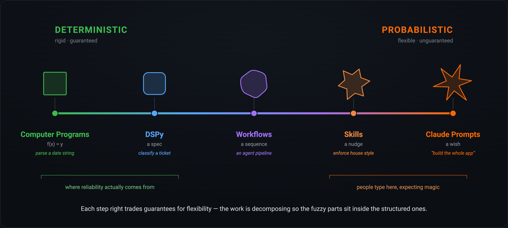
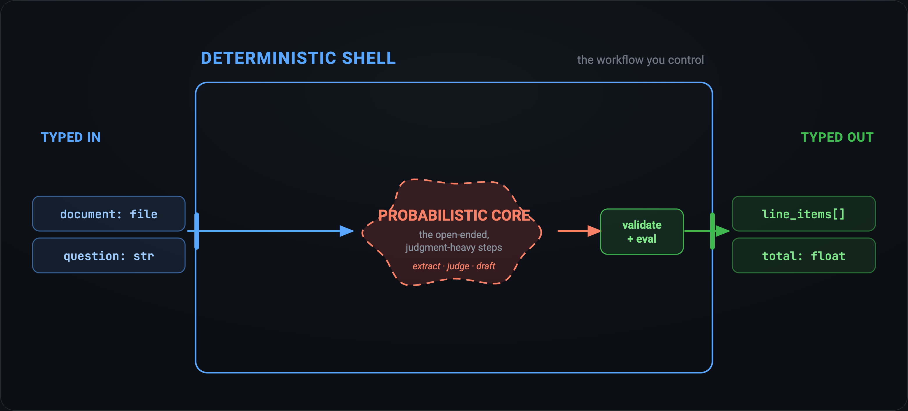
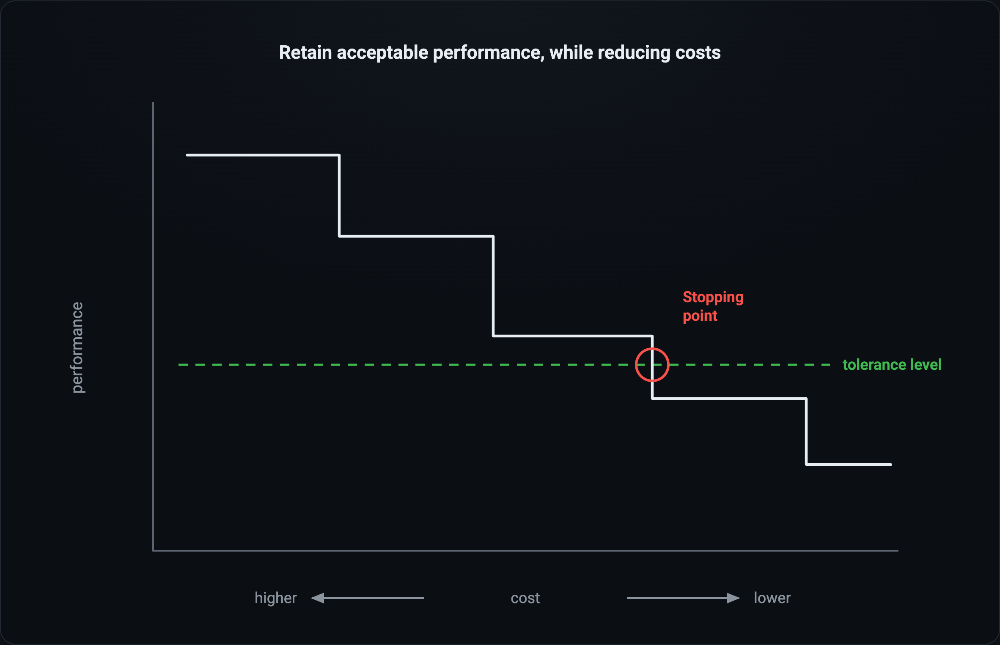
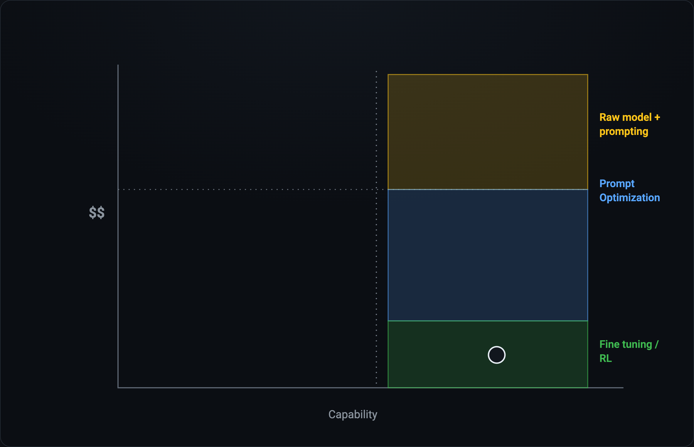

[Satya Nadella recently published an excellent article](https://x.com/ainativefirm/status/2066243834208784656) on what a future firm looks like in an AI-driven economy. He also introduces the concept of "token capital" which now exists alongside human capital (and financial capital).

A natural extension is token capital efficiency, which can be defined as the business value an organization captures per dollar invested in tokens; i.e., value generated divided by the volume of tokens consumed times their price, across reasoning, task execution, and learning. Higher efficiency comes from extracting more value per token, consuming fewer tokens per outcome, or sourcing tokens more cheaply. This is directly enabled by a new motion for firms, namely, how well an organization can represent valuable knowledge work as tokens an LLM can process reliably.

Almost no firm today is token capital efficient. Everyone is figuring it out on the fly, often to the detriment of technology budgets.

Everyone blindly defaults to the latest model, and now the bill is coming due.

In about eighteen months we have round-tripped from tokenmaxxing to a token spend backlash. CFOs and boards with surprise bills are starting to ask questions. At the center is a core tension between companies rushing to "do AI"—whatever that may mean—and the need for financial responsibility. The usage patterns of this technology are different from other enterprise software in that it is simultaneously ubiquitous and often billed on a usage basis. That, coupled with the speed of advancements, means that everyone automatically defaults to the best model for everything, hoping to get the best performance possible regardless of task.

Most organizations are pushing every user, regardless of technical sophistication, to use AI as much as possible. That's fine; 99% of users shouldn't have to know the capability difference between an Opus-class and a Haiku-class model, but at enterprise scale there is a meaningful difference. But the directive of "use AI as much as possible" with no boundary or governance is exactly how you get ballooning bills with an unclear return profile. This approach also suffers from variable outcomes, because often people are writing two-sentence prompts and hoping for the best.

We're at the point where models are getting so good that there's an emerging bifurcation in requirements for frontier vs "commoditized" AI usage. Frontier capability is useful for exploring true unknowns, for planning complex activities, and more advanced reasoning. For more common, well-defined tasks, frontier models are likely overkill. This article covers what an approach could look like for structured, well-understood tasks.

The most obvious way to make an impact is to match task complexity with model capability. But to do so, the tasks themselves need to be well understood.

By taking the time to define tasks that are meaningful, you can dramatically improve your token capital efficiency (that is, simultaneously reduce cost and improve outcomes).

Picture every way we get a computer to do something as a single spectrum, running from fully deterministic to fully probabilistic. On the far left is the ordinary computer program we've always written: formulaic, deterministic and measurable by construction. As you move right, you trade determinism for flexibility, ceding more of the *how* to the model—first as a spec, then a workflow, then a "nudge"—until on the far right you reach a raw LLM prompt: maximum flexibility, minimum guarantees. The crucial thing here is that the *what* never disappears. You always have an intent; that is, what it is you want to achieve. It's only the specification of the *how* that fades out as you move to the right.

Most enterprise users and tokenmaxxers live on the right: defer everything to the model. That's a reasonable place to be for certain work. Coding agents fit this well, for instance, because a mature codebase gives the model something to bump up against in the form of tests. A failing test is a boundary. Most knowledge work today has no such boundary, at least not ones that are digitally codified as a test, and this is the source of variable outcomes and associated frustration.

But there are many tasks a knowledge worker does that can have well-defined boundaries such that they can move left on this chart and be much more token capital efficient. Doing this well comes down to a sequence: define the task, match a model to it, measure the result, then optimize.

Decomposing complex processes into discrete tasks reduces variance.

An effective, discrete task is generally a well-defined set of inputs, which may include certain criteria or process steps, and a desired set of outputs, such that you can measure the acceptability of the output.

For example, say I want to examine an invoice and extract a few key details about particular line items in an output that I can put into a database and work with programmatically. I can give a human a PDF and a spreadsheet, or I can throw these into Claude and outline the objective and desired outputs. Both have some tradeoffs in terms of variability, consistency, speed, and cost.

Unless you write down each step in the process in excruciating detail, there's almost always going to be a gap in specification; there's no feedback mechanism, and it's a cumbersome way to run a business process. Most importantly, any gap you leave in your prompt introduces potential variance into the output.

By wrapping the probabilistic core in a deterministic shell, you can harness the power of the models to do the hard work 'in the middle' while retaining the ability to understand and monitor the inputs and outputs of the process in a consistent way.

The wrapping of the model is important because the less you specify the more the model has to "improvise" and for LLMs this trends toward the average of its training data. Thariq from Anthropic put it about as well as it can be put:

> "Every gap you leave, Claude fills with in-distribution choice."
>
> — [@trq212](https://x.com/trq212), at CAIS (h/t Drew Breunig [@dbreunig](https://x.com/dbreunig))

The discipline of being thorough in how you specify the inputs, the outputs, and the process also becomes a compounding differentiator: every set of tasks you define and build evals around becomes something you own. It's the expertise and IP that makes your company unique. Evals are the mechanism by which you can know for a given set of inputs the process delivers an acceptable quality of outputs and is operating as you expect it to.

Just as important is that the IP is composable. Agents can start to string together battle-hardened tasks that they can use without reinventing the wheel each time (and spending tokens to do so).

## You match to the right model by measuring it

With the task defined, the question that started all this comes back around: which model should run it? The temptation is to answer by reputation or benchmark. Reach for the frontier model and move on. But reputation or score doesn't give you enough information to make a decision. A more effective way to match a model to a task is to measure candidates against the task you just defined.

There are at least two measurable dimensions that matter: capability and cost. If you haven't defined the task, you can't measure its success rate. And if you can't measure success, two things follow:

- You can't quantify outcomes (or returns) at any scale a CFO would accept, and
- You can't move to a different model while retaining an acceptable level of performance, because you never defined the performance bar you'd be holding to in the first place.

This is the same point [Satya made recently](https://x.com/satyanadella/status/2066182223213293753):

> "A company should be able to switch out a 'generalist' model without losing the 'company veteran' expertise built into their learning system."

There's opportunity in building a scaffold that captures your IP such that you don't feel forced to always default to the latest or largest model. And this cuts both ways—you can move down the cost curve but you can also "ride the wave" of better models without having to re-engineer your workflow each time, because it's already been defined.

Once you have the ability to evaluate outcomes, you can move down the cost curve effectively, but only because you can determine what your tolerance level is specific to your business. Public benchmarks are good directional indicators but say nothing about a model's capability to execute a workflow within your accounting department. On your specific tasks, an eval becomes your IP, because it's the boundary that measures a model's performance. This is exactly what Satya means when he says a firm's private evals should track improvement against the outcomes that matter to the business.

## Everything is an optimization problem

Once you have a task definition and an eval to score it, everything turns into an optimization problem. You can walk down the cost curve: smaller models, tighter prompts, less scaffolding. You keep going until performance crosses the tolerance level you defined at the outset (e.g., I can accept 97% accuracy on a classification task). That crossing is your stopping point, and done correctly, you may have saved an order of magnitude in terms of cost. Without a spec and an eval, you can't even see this chart. At that point you're just guessing and hoping the bill goes down.

A natural first step is using what the models give you by doing prompt optimization—and it is not something you do by hand. With frameworks and techniques like [@DSPyOSS](https://x.com/DSPyOSS) + [GEPA](https://github.com/gepa-ai/gepa) you can a) structure your tasks in a maintainable, measurable way, and b) automatically identify which cheaper models work for your use case with acceptable accuracy. For certain high-volume and well-understood processes, fine-tuning or RL start to make more sense.

## Can you measure your token capital efficiency?

It may sound obvious, but companies that can create an inventory of valuable tasks and evals used to run their business will save costs in the short term, but more importantly they'll be set up to do what Satya calls out as the most important thing: the ability to "build the learning loop … where human capital and token capital compound".

Organizations are large compound systems with workers executing tasks as part of their job in pursuit of some overarching set of objectives. The organizations that learn to create a digital inventory of important work won't just spend less than competitors in the AI era, they'll benefit from compounding knowledge, model capability, and cost improvements, while competitors flail around re-writing prompts from scratch. Those with high token capital efficiency will win.
