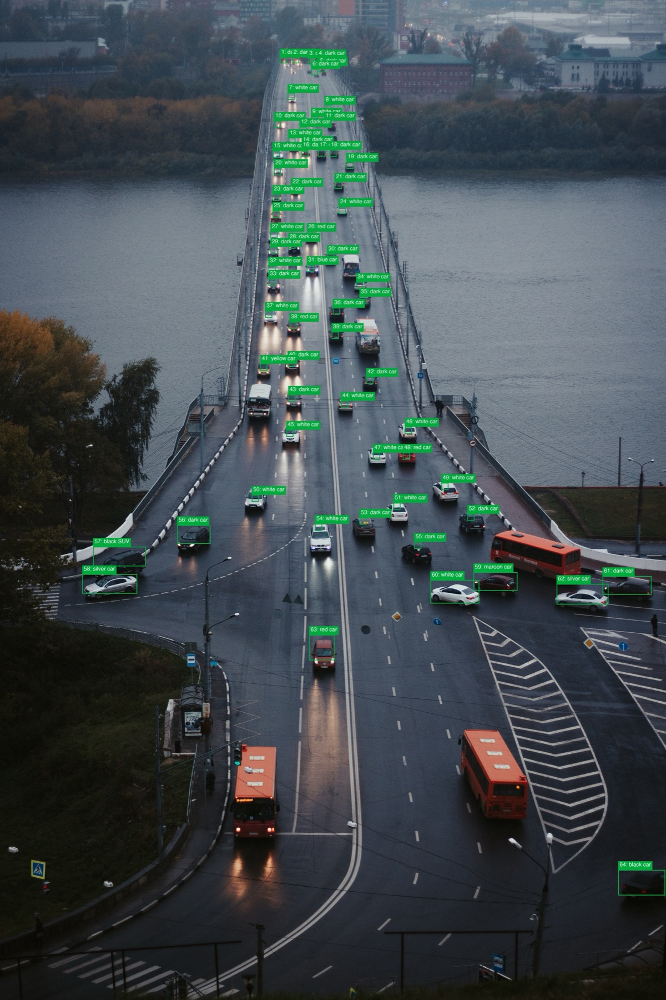
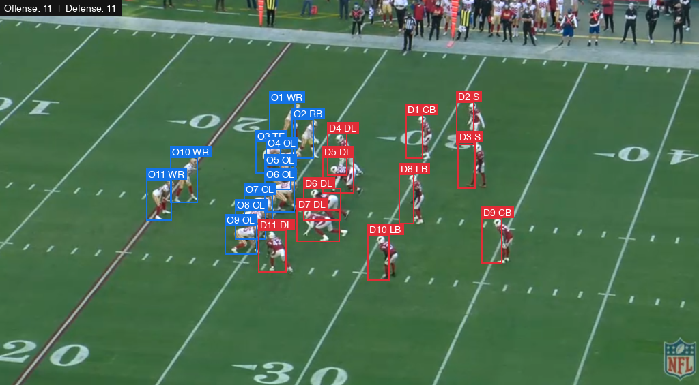
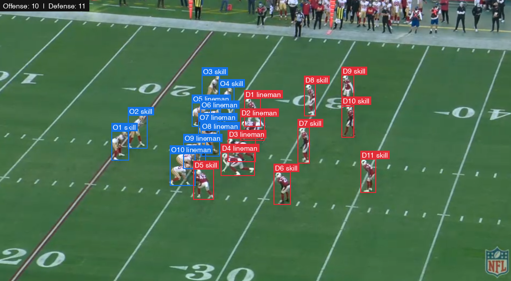
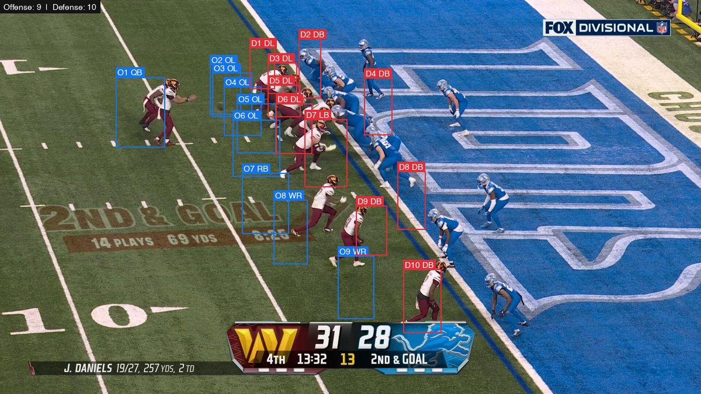
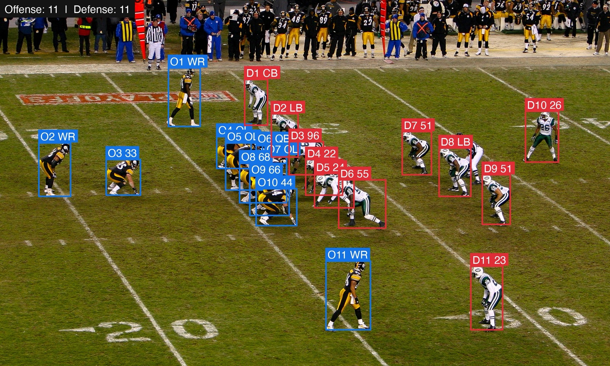
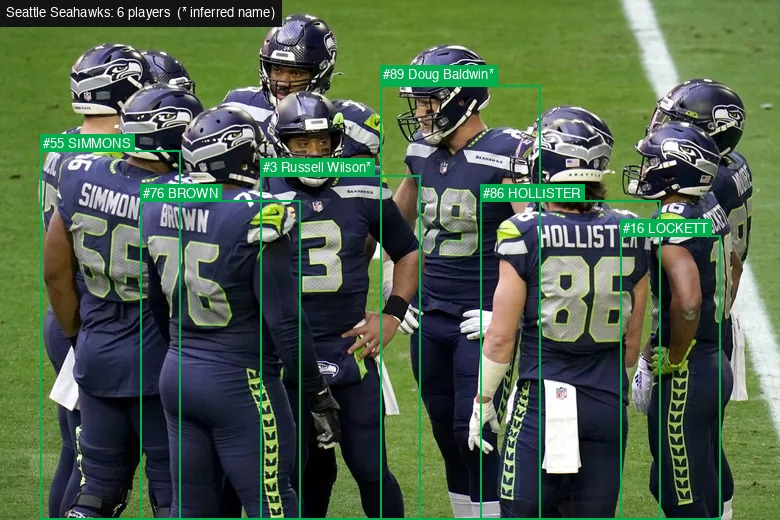

Qwen3.8-Max arrived with strong multimodal results, so I wanted to try something more concrete than visual Q&A: give it an image, ask for structured bounding boxes, and draw the answer back onto the pixels. This is a common workflow also supported in previous models.

The experiment started with a traffic image and quickly expanded into football, trying things like counting the players on each side of the ball, predict the defensive coverage, and read jersey numbers and names. Each example is a small Python script using Qwen3.8-Max through OpenRouter, with Pillow handling the overlays.

The basic request looks like this:

```text
Detect every car in this image. Return only JSON:
{"count": N, "cars": [{"label": "white car",
"bbox": [x1, y1, x2, y2]}, ...]}
```

The response is ordinary JSON. The rest of the program validates it, draws rectangles and labels, and saves a new image.

## Counting cars

The first useful lesson was simple: tell the model the image's actual dimensions. My original script hard-coded 1920×1080. The larger test image was 3403×5104, so even a good detection would have produced misplaced boxes.

After reading the dimensions with Pillow and inserting them into the prompt, Qwen returned 64 cars with boxes that aligned surprisingly well, including vehicles that occupy only a few pixels near the horizon. Note that it ignored busses.



## Football

With the NFL season right around the corner I was curious to see how the model would perform on real-world sports scenarios, inspiried by the great work of [@skalskip92](https://x.com/skalskip92) from Roboflow. The football version needed a more precise definition of what to look for. The source frame includes coaches, officials, substitutes, and other people along the sideline. The prompt explicitly excludes them and asks the model to classify players by football role and alignment—not by which half of the image they happen to occupy.

DSPy makes this definition easy:

```python

MODEL = "qwen/qwen3.8-max"
COLORS = {"offense": (20, 115, 230), "defense": (225, 45, 55)}


class Player(BaseModel):
    """One active player and their normalized bounding box."""

    side: Literal["offense", "defense"]
    bbox: list[int] = Field(
        description=(
            "Tight [x1, y1, x2, y2] bounding box using integer coordinates "
            "from 0 to 1000 on both axes"
        ),
        min_length=4,
        max_length=4,
    )

```

On the example frame, it returned 11 offensive players and 11 defensive players. Blue boxes represent offense; red boxes represent defense.



Adding a 'skill' vs. 'lineman' field to the `Player` model actually worked well, though the model then missed counting one of the offensive players:

```python
position: Literal["lineman", "skill"] = Field(
        description=(
            "Broad position group: lineman for offensive-line and defensive-front "
            "players aligned on the line of scrimmage; skill for every other player"
        )
    )
```




This approach is not equally reliable on every camera angle. In a compressed goal-line formation, it returned nine offensive and ten defensive players. Bodies overlap heavily at the line of scrimmage, and several players are only partly visible behind teammates. The undercount is visible in the output rather than hidden inside a single aggregate score.



A wider sideline view was easier. The model again found 11 players on each side, including receivers and defensive backs spread far from the line. The boxes are generally strong, although the optional position and jersey labels are less dependable than the offense/defense classification itself.




Another example of detecting jerseys combines three different tasks that are easy to conflate:

1. Detect the player.
2. Read a number or surname from the uniform.
3. Infer an identity from team and roster knowledge.

The script records whether a name was directly visible or inferred and marks inferred names with an asterisk. In the Seahawks image, it cleanly read visible surnames including Brown, Hollister, Simmons, and Lockett, and it associated number 3 with Russell Wilson.



The model isn't perfect here: Simmons is labeled as number 55 despite the obscured digits (where it should actually be 66), and inferred Doug Baldwin for number 89 even though that's not actually him in the photo. The boxes are good but the inferred content isn't always great, particularly because this is an older photo.

For a real system I would keep OCR and roster resolution separate: extract only visible text first, then match `(team, season, number)` against an authoritative roster database. A vision model's memory should not be the database.

## A coordinate-system trap

Qwen sometimes returned literal pixel coordinates and sometimes used the normalized 0–1000 coordinate convention common in vision-language models. On a 1024×566 football frame, an apparently plausible box ending at `y=710` was the clue: the vertical coordinate was normalized, not a pixel.

The robust version asks explicitly for normalized coordinates on both axes and then computes the coordinates deterministically:

```python
x = round(normalized_x * width / 1000)
y = round(normalized_y * height / 1000)
```

This avoids coupling the model's output schema to image resolution and makes portrait, landscape, and square inputs behave consistently.

## Takeaway

The impressive part is not that a frontier model can say "there are cars" or "this is a football game." It can return enough spatial structure to drive a conventional image-processing pipeline, while also applying domain concepts such as offense, defense, and position types. The combination of concepts here opens up a wide number of interesting use cases.


The useful pattern is straightforward: let the model handle perception and semantic grouping, keep the output contract small and explicit, and use deterministic code for coordinates, validation, and rendering. For anything near-real-time you'll still want to use something like [Roboflow](https://roboflow.com).

# Appendix

Full code for the football-with-position extract:

```python
# /// script
# requires-python = ">=3.11"
# dependencies = ["dspy==3.3.0", "pillow"]
# ///
"""Use DSPy 3.3 to classify football players by side and position group."""

import argparse
import json
import os
import sys
from pathlib import Path
from typing import Literal

import dspy
from PIL import Image, ImageDraw, ImageFont
from pydantic import BaseModel, Field

MODEL = "qwen/qwen3.8-max"
COLORS = {"offense": (20, 115, 230), "defense": (225, 45, 55)}


class Player(BaseModel):
    """One active player, their classifications, and normalized bounding box."""

    side: Literal["offense", "defense"]
    position: Literal["lineman", "skill"] = Field(
        description=(
            "Broad position group: lineman for offensive-line and defensive-front "
            "players aligned on the line of scrimmage; skill for every other player"
        )
    )
    bbox: list[int] = Field(
        description=(
            "Tight [x1, y1, x2, y2] bounding box using integer coordinates "
            "from 0 to 1000 on both axes"
        ),
        min_length=4,
        max_length=4,
    )


class CountPlayersBySide(dspy.Signature):
    """Analyze an American football image and find every active player.

    Classify each player as offense or defense. Determine the side from football
    role and team alignment, not from which half of the image the player
    occupies. Also classify each player's broad position group as "lineman" or
    "skill". Use "lineman" for offensive-line and defensive-front players
    aligned on the line of scrimmage. Use "skill" for every other player,
    including quarterbacks, backs, receivers, tight ends, linebackers, and
    defensive backs. Do not infer a more specific position, jersey number, or
    name.

    Exclude officials, coaches, substitutes, spectators, and everyone on the
    sideline. Include partially visible active players.

    Use normalized integer bounding-box coordinates from 0 to 1000 on both
    axes, independent of image aspect ratio. Every active player must appear
    exactly once. Return the final list without an explanation.
    """

    image: dspy.Image = dspy.InputField(desc="The football image to analyze")
    players: list[Player] = dspy.OutputField(
        desc=(
            "Every active player, classified by side and broad position group, "
            "with a tight bounding box"
        )
    )


def parse_args() -> argparse.Namespace:
    parser = argparse.ArgumentParser(
        description="Classify players by side and position group and draw boxes."
    )
    parser.add_argument("image", type=Path, help="input image (for example, nfl.png)")
    parser.add_argument(
        "-o",
        "--output",
        type=Path,
        help="annotated output image (default: <input>_sides_positions_boxes.<ext>)",
    )
    return parser.parse_args()


def load_font(size: int) -> ImageFont.FreeTypeFont | ImageFont.ImageFont:
    try:
        return ImageFont.truetype("/System/Library/Fonts/Helvetica.ttc", size)
    except OSError:
        return ImageFont.load_default()


def main() -> None:
    args = parse_args()
    image_path = args.image.expanduser().resolve()
    if not image_path.is_file():
        sys.exit(f"image not found: {image_path}")

    output_path = (
        args.output.expanduser().resolve()
        if args.output
        else image_path.with_name(
            f"{image_path.stem}_sides_positions_boxes{image_path.suffix}"
        )
    )

    key = os.environ.get("OPENROUTER_API_KEY")
    if not key:
        sys.exit("OPENROUTER_API_KEY is not set")

    with Image.open(image_path) as source:
        width, height = source.size

    lm = dspy.LM(
        f"openrouter/{MODEL}",
        api_key=key,
        max_tokens=5000,
        reasoning={"max_tokens": 1000, "exclude": True},
        timeout=180,
    )
    dspy.configure(lm=lm, adapter=dspy.JSONAdapter())
    count_players = dspy.Predict(CountPlayersBySide)

    # DSPy 3.3 requires explicit I/O for local resources. Image.from_path()
    # reads and embeds the image; dspy.Image(image_path) no longer does so.
    result = count_players(
        image=dspy.Image.from_path(image_path),
    )
    players = result.players
    counts = {
        side: sum(player.side == side for player in players)
        for side in COLORS
    }
    position_counts = {
        side: {
            position: sum(
                player.side == side and player.position == position
                for player in players
            )
            for position in ("lineman", "skill")
        }
        for side in COLORS
    }
    print(
        json.dumps(
            {
                "offense_count": counts["offense"],
                "defense_count": counts["defense"],
                "position_counts": position_counts,
                "players": [player.model_dump() for player in players],
            },
            indent=2,
        )
    )

    image = Image.open(image_path).convert("RGB")
    draw = ImageDraw.Draw(image)
    scale = max(1, round(min(width, height) / 550))
    font = load_font(14 * scale)
    pad = 3 * scale
    side_numbers = {"offense": 0, "defense": 0}

    for player in players:
        side = player.side
        side_numbers[side] += 1
        nx1, ny1, nx2, ny2 = player.bbox
        x1, x2 = round(nx1 * width / 1000), round(nx2 * width / 1000)
        y1, y2 = round(ny1 * height / 1000), round(ny2 * height / 1000)
        x1, x2 = sorted((max(0, min(width - 1, x1)), max(0, min(width - 1, x2))))
        y1, y2 = sorted((max(0, min(height - 1, y1)), max(0, min(height - 1, y2))))
        color = COLORS[side]
        draw.rectangle((x1, y1, x2, y2), outline=color, width=2 * scale)

        label = (
            f"{'O' if side == 'offense' else 'D'}{side_numbers[side]} "
            f"{player.position}"
        )
        text_box = draw.textbbox((0, 0), label, font=font)
        text_width = text_box[2] - text_box[0]
        text_height = text_box[3] - text_box[1]
        label_y = max(0, y1 - text_height - 2 * pad)
        draw.rectangle(
            (x1, label_y, x1 + text_width + 2 * pad, label_y + text_height + 2 * pad),
            fill=color,
        )
        draw.text((x1 + pad, label_y + pad), label, fill="white", font=font)

    summary = f"Offense: {counts['offense']}  |  Defense: {counts['defense']}"
    summary_box = draw.textbbox((0, 0), summary, font=font)
    summary_width = summary_box[2] - summary_box[0]
    summary_height = summary_box[3] - summary_box[1]
    draw.rectangle(
        (0, 0, summary_width + 4 * pad, summary_height + 4 * pad), fill=(20, 20, 20)
    )
    draw.text((2 * pad, 2 * pad), summary, fill="white", font=font)

    save_options = (
        {"quality": 92} if output_path.suffix.lower() in {".jpg", ".jpeg"} else {}
    )
    image.save(output_path, **save_options)

    print(f"\noffense: {counts['offense']}")
    print(f"defense: {counts['defense']}")
    print(f"position groups: {json.dumps(position_counts)}")
    print(f"overlay saved to {output_path}")


if __name__ == "__main__":
    main()
```